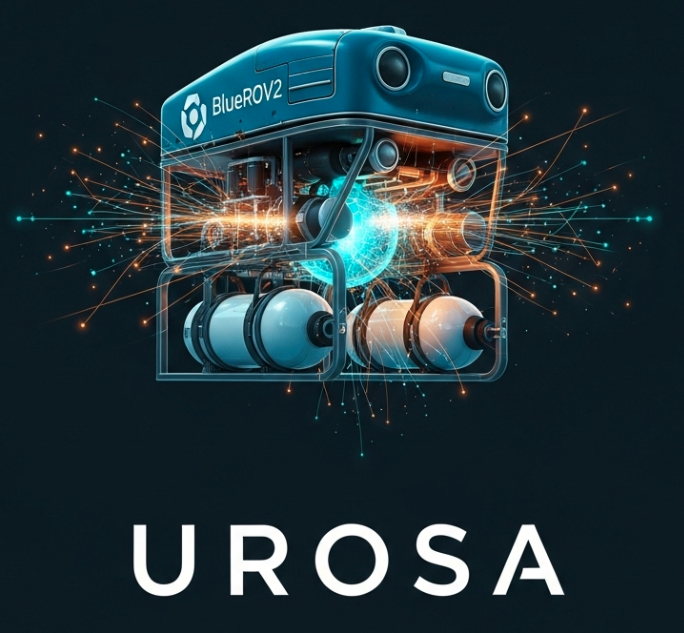

<p align="center">
  
</p>


<h1 align="center">
  UROSA: Distributed AI Agents for Cognitive Underwater Robot Autonomy
</h1>

---

This repository contains the official implementation of UROSA (Underwater Robot Self-Organizing Autonomy), a framework for building truly autonomous robots using a distributed network of AI agents in ROS 2. <br>

## Introduction
Traditional robotic systems are powerful in controlled settings but often struggle in complex, unpredictable environments like the underwater world. Their reliance on pre-programmed, rule-based algorithms limits their ability to adapt to novel situations, requiring constant human oversight and reprogramming.

## Architecture Overview

UROSA is built on a two-layer architecture designed to separate high-level reasoning from low-level control, all orchestrated within the ROS 2 ecosystem.

 

* **Cognitive Layer:** This is the "brains" of the operation. It contains the distributed network of specialized AI agents that perform tasks like planning, reasoning, and diagnostics.
* **ROS 2 Layer:** This is the "nervous system" of the robot. It handles all communication between agents, interfacing with the robot's hardware (sensors and actuators), and connecting to the simulator.

The fundamental building block of UROSA is the **Agentic ROS 2 Node**, where an LLM is embedded directly inside a ROS 2 node. This makes each agent a first-class citizen in the robotics ecosystem. The **Brain Agent** acts as a central orchestrator and knowledge manager, while **Specialist Agents** (e.g., for Vision, Motion, Diagnostics) execute specific tasks.

## Our Solution: UROSA
UROSA shifts the paradigm from writing rigid, low-level code to setting high-level mission goals. We replace the traditional, monolithic control program with a "cognitive ecosystem" of specialized AI agents. Each agent is an intelligent, ROS 2-native module responsible for a specific task—like vision, motion planning, or diagnostics.

These agents collaborate, reason about their environment, and make decisions autonomously, allowing the system to handle unforeseen events and achieve complex objectives with minimal human intervention.

### Key Features
- 🤖 **Agentic AI in ROS 2**: Seamlessly integrate powerful, pre-trained LLM agents directly into your ROS 2 computation graph.
- 🧠 **Decentralized Cognition**: Create robust, fault-tolerant systems where multiple agents work together to solve problems.
- ⚡ **Dynamic Adaptation**: Agents can reason about their environment and adapt their behavior in real-time based on live sensor data or changing mission needs.
- ✍️ **On-the-Fly Code Generation**: The system can autonomously write, test, and deploy new ROS 2 nodes at runtime to extend its own functionality when it encounters a new challenge.
- 📈 **Advanced Diagnostics**: Move beyond static fault trees with an AI agent that can diagnose complex system health issues by learning the vehicle's normal behavior.
- 📚 **Experiential Learning**: Utilize a Vector Database to enable agents to learn from past experiences, improving performance and robustness over time.

---
## Getting Started

This section will guide you through setting up the UROSA environment and running the core framework.

### Prerequisites

- Docker
- NVIDIA Docker support for GPU acceleration (recommended)

### Installation and Setup

1.  **Clone the Repository**

    First, clone the UROSA repository to your local machine:

    ```bash
    git clone https://github.com/markusbuchholz/urosa_underwater_autonomy
    cd urosa_underwater_autonomy/docker
    ```

2.  **Build the Docker Image**

    The provided script will build the Docker image with all the necessary dependencies, including ROS 2 and the UROSA packages.

    ```bash
    sudo ./build.sh
    ```

3.  **Run the Docker Container**

    This command will start the Docker container and give you an interactive shell within the UROSA environment.

    ```bash
    sudo ./run.sh
    ```

### Setting up the Local AI Agent with Ollama

UROSA's agents are powered by Large Language Models (LLMs). We use Ollama to run these models locally. Follow these steps to set up the required AI agent.

1.  **Install Ollama**

    Ollama is a tool for running LLMs locally. Open a new terminal on your host machine (outside the Docker container) and run the following command to install it:

    ```bash
    curl -fsSL [https://ollama.com/install.sh](https://ollama.com/install.sh) | sh
    ```
    This script downloads and installs Ollama on your system.

2.  **Pull a Base Model**

    Next, you need a base model from which to create our specialized ROS 2 agent. We will use e.g. ```llama3```.

    All models are available [here](https://ollama.com/search).

    ```bash
    ollama pull llama3
    ```
    This command downloads the pre-trained Llama 3 model to your machine.

4.  **Create a Custom Model File**

    To make the LLM act as a specialized ROS 2 agent, we need to give it a specific ```system prompt```. We first create a template from the existing `llama3` model.

    The model file specification can be found [here](https://github.com/ollama/ollama/blob/main/docs/modelfile.md).

    ```bash
    ollama show --modelfile llama3 > ros2_model_file
    ```
    This command extracts the configuration (Modelfile) of the `llama3` model and saves it to a file named `ros2_model_file`.

6.  **Define the Agent's Behavior**

    Open the `ros2_model_file` with a text editor. You will see a `SYSTEM` parameter. This is the core instruction that defines the AI's personality, capabilities, and constraints. **Modify the `SYSTEM` prompt** to define the behavior of your ROS 2 agent. For example:

    ```
    # Modelfile generated by "ollama show"
    # To build a new model, create a new file with this content and update the Modelfile
    # (e.g. FROM, PARAMETER, TEMPLATE, SYSTEM, ADAPTER)

    FROM llama3

    # set the temperature to 1 [higher is more creative, lower is more coherent]
    PARAMETER temperature 1

    # The SYSTEM prompt is the most important part.
    # It sets the instructions for the AI agent.
    SYSTEM """
    You are a helpful ROS 2 expert AI assistant.
    Your role is to assist with tasks related to the Robot Operating System 2 (ROS 2).
    You should be able to understand ROS 2 concepts, generate code snippets, debug issues, and provide clear explanations.
    You must always provide safe and valid ROS 2 code and commands.
    """
    ```

7.  **Create the Custom Agent**

    Now, create the new agent model using your modified `ros2_model_file`.

    ```bash
    ollama create ros2_ai_agent --file ros2_model_file
    ```
    This command bundles your custom system prompt and the base model into a new, specialized model named `ros2_ai_agent`.

8.  **Run Your Custom Agent**

    You can now run your custom agent and interact with it directly from the command line.

    ```bash
    ollama run ros2_ai_agent
    ```
    You are now ready to integrate this running agent with the UROSA framework inside the Docker container.

---

## Core Mechanisms

UROSA's capabilities are enabled by a series of novel mechanisms that showcase the power of distributed agentic AI. Here’s a simple breakdown of the key innovations:

### Decentralized Reasoning & Multi-Agent Coordination
Instead of a single "brain," UROSA's agents work together as a team. They can communicate with each other to solve complex problems that a single agent could not, such as having two underwater vehicles autonomously negotiate a collision-free path in a cluttered environment.

### Experiential Learning with a Vector Database (RAG)
UROSA agents have a long-term memory. Using a Vector Database (VDB), agents can store and recall past experiences (both good and bad). When faced with a new challenge, like tracking a pipe that becomes hidden, an agent can query its memory to predict where the pipe should be, allowing it to recover much faster than if it were starting from scratch.

### On-the-Fly Code Generation
When UROSA's Brain Agent identifies a missing capability—like a specific data filter or a new planning algorithm—it can task a specialized `Node Gen` agent to **write, test, and deploy a new ROS 2 node at runtime**. The system literally extends its own software functionality without any human intervention.

### Dynamic System Diagnostics
A dedicated Diagnostic Agent continuously monitors the robot's health data (e.g., thruster power, sensor readings). By learning what "normal" looks like, it can diagnose complex, non-obvious failures (like a sluggish thruster) that would be missed by traditional systems that only check for pre-defined error codes.

### Online Behavioral Tuning (Teacher-Student)
One agent can "teach" another to improve its behavior in real-time. For example, a Teacher agent can provide feedback to a Student vision agent, guiding it to make its textual descriptions more concise or to focus on specific objects in a scene, effectively refining its policy on-the-fly.

### Inherent Safety
Safety is built-in at multiple levels. Every agent's behavior is constrained by a "scaffolding" prompt during its creation, and its final output is checked by a `Safety Parser` before being executed. This multi-layered approach ensures that the agents act in a predictable, verifiable, and safe manner.

---
## Citation
```bibtex
@inproceedings{buchholzUROSA2025,
  author    = {Buchholz, Markus and Carlucho, Ignacio and Grimaldi, Michele and Petillot, Yvan R.},
  title     = {Distributed AI Agents for Cognitive Underwater Robot Autonomy},
  booktitle = {Proceedings of the ... Conference},
  year      = {2025}
}
