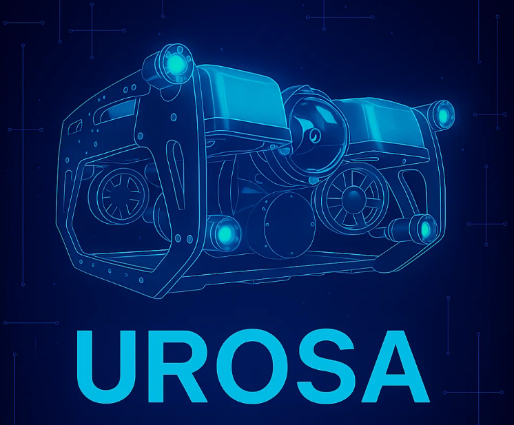
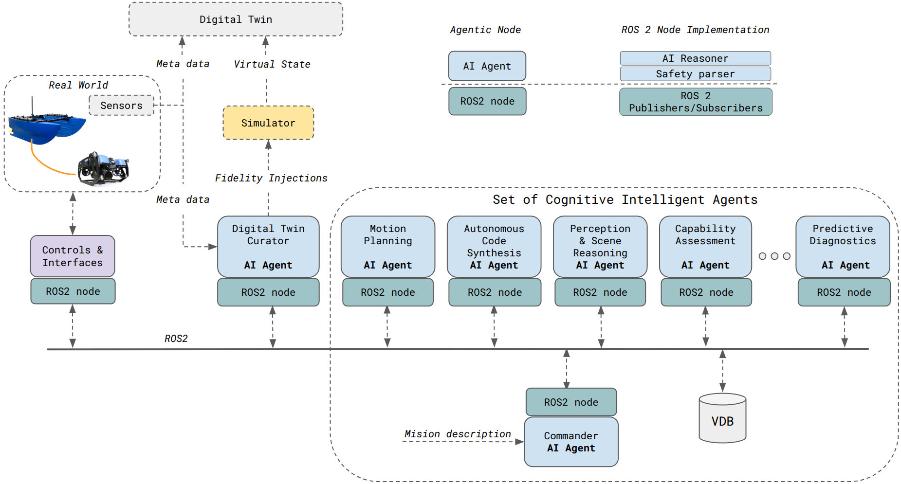
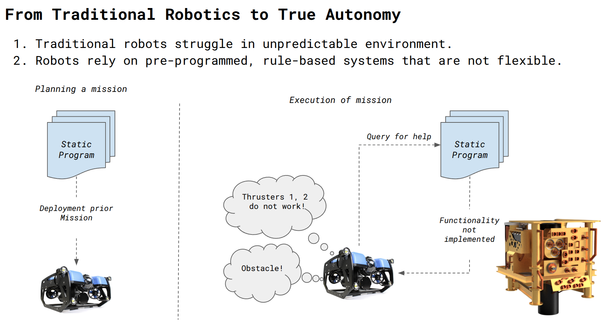
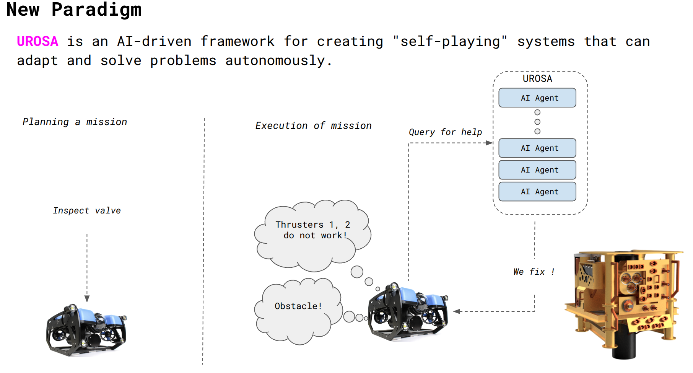

<p align="center">
  
</p>


<h1 align="center">
  Distributed AI Agents for Cognitive Underwater Robot Autonomy
</h1>


Following repository contains the official implementation of **UROSA (Underwater Robot Self-Organizing Autonomy)**, a framework for building truly autonomous robots using a distributed network of AI agents in ROS 2. <br>


## Introduction

Traditional robotic systems are powerful in controlled settings but often struggle in complex, unpredictable environments like the underwater world. Their reliance on pre-programmed, rule-based algorithms limits their ability to adapt to novel situations, requiring constant human oversight and reprogramming.

## UROSA Presentation

Visit official [web page](https://markusbuchholz.github.io/urosa.html) to check details.


## Architecture Overview

 

UROSA is built on a two-layer architecture designed to separate high-level reasoning from low-level control, all orchestrated within the ROS 2 ecosystem.
* **Cognitive Layer:** This is the "brains" of the operation. It contains the distributed network of specialized AI agents that perform tasks like planning, reasoning, and diagnostics.
* **ROS 2 Layer:** This is the "nervous system" of the robot. It handles all communication between agents, interfacing with the robot's hardware (sensors and actuators), and connecting to the simulator.

The fundamental building block of UROSA is the **Agentic ROS 2 Node**, where an LLM is embedded directly inside a ROS 2 node. This makes each agent a first-class citizen in the robotics ecosystem. The **Brain Agent** acts as a central orchestrator and knowledge manager, while **Specialist Agents** (e.g., for Vision, Motion, Diagnostics) execute specific tasks.
Each **Agentic Node**, fuses the high-level AI Agent with its ```ROS 2 Node Implementation```, encapsulating the ```AI Reasoner```, a ```Safety Parser```, and communication interfaces.

## Our Solution: UROSA - transition to True Robot Autonomy

UROSA shifts the paradigm from writing rigid, low-level code to setting high-level mission goals. We replace the traditional, monolithic control program with a "cognitive ecosystem" of specialized AI agents. Each agent is an intelligent, ROS 2-native module responsible for a specific task—like vision, motion planning, or diagnostics.

### Legacy approach

<p align="center">
  
</p>

### AI Autonomy

<p align="center">
  
</p>

---

## Before You Start

Following steps demonstrate how to run **UROSA**.

The core idea is to create a custom LLM agent tailored for ROS 2 tasks and then interface it with a ROS 2 node. This node acts as the bridge, feeding information from ROS topics to the LLM and translating the LLM's responses back into actionable commands for the robot.

### Repository Structure
To help you navigate this project, here is a brief overview of the key directories inside the ```src``` folder:

- ```knowledge```: This directory contains the resources for building your custom AI agent. The files here, like ros2_model_file, are created from a base model template (e.g., llama3) and are customized by modifying the ```SYSTEM prompt```. This prompt defines the agent's personality, expertise, and response format, as detailed in the Getting Started guide.

- ```autonomy```: This folder holds the example ROS 2 Python scripts. These nodes, like the one described in the Run UROSA section, demonstrate how to subscribe to ROS topics, interact with your custom LLM agent, parse its output, and publish commands to control robotic behavior.

### How to Proceed
- ```Getting Started:``` This first section will guide you through installing the necessary tools (like Ollama) and creating your very own specialized ros2_ai_agent.

- ```Run UROSA:``` This second section provides a practical example of how to run the ROS 2 node that brings your agent to life, showing how it receives missions and translates them into robotic actions.

---

## Getting Started

This section will guide you through setting up the UROSA environment and running the core framework.

### Prerequisites

- Docker
- NVIDIA Docker support for GPU acceleration
- StoneFish underwater simulator or GazeboSim (optional)

### Installation and Setup

1.  **Clone the Repository**

    First, clone the UROSA repository to your local machine:

    ```bash
    git clone https://github.com/markusbuchholz/urosa_underwater_autonomy
    cd urosa_underwater_autonomy/docker
    ```

2.  **Build the Docker Image**

    The provided script will build the Docker image with all the necessary dependencies, including ROS 2 and the UROSA packages.

    ```bash
    sudo ./build.sh
    ```

3.  **Run the Docker Container**

    This command will start the Docker container and give you an interactive shell within the UROSA environment.

    ```bash
    sudo ./run.sh
    ```
---

## Run UROSA

UROSA's agents are powered by LLMs. We use Ollama to run these models locally. Follow these steps to set up the required AI agent.

1.  **Install Ollama**

    Ollama is a tool for running LLMs locally. Open a new terminal on your host machine (outside the Docker container) and run the following command to install it:

    ```bash
    curl -fsSL [https://ollama.com/install.sh](https://ollama.com/install.sh) | sh
    ```
    This script downloads and installs Ollama on your system.

2.  **Pull a Base Model**

    Next, you need a base model from which to create our specialized ROS 2 agent. We will use e.g. ```llama3```.

    All models are available [here](https://ollama.com/search).

    ```bash
    ollama pull llama3
    ```
    This command downloads the pre-trained Llama 3 model to your machine.

3.  **Create a Custom Model File**

    To make the LLM act as a specialized ROS 2 agent, we need to give it a specific ```system prompt```. We first create a template from the existing `llama3` model.

    The model file specification can be found [here](https://github.com/ollama/ollama/blob/main/docs/modelfile.md).

    ```bash
    ollama show --modelfile llama3 > ros2_model_file
    ```
    This command extracts the configuration (Modelfile) of the `llama3` model and saves it to a file named `ros2_model_file`.

4.  **Define the Agent's Behavior**

    Open the ros2_model_file with a text editor. Inside, the SYSTEM parameter is the most important part—it's the core instruction that defines the AI's personality, capabilities, and constraints.

    For this example, we will instruct the agent to perform a very specific task: extract position coordinates from a user's request and provide them in a precise format. This ensures the output can be reliably parsed by our ROS 2 node.

    Modify the contents of ros2_model_file to look like this simplified example:

    ```bash
    FROM llama3:latest

    FROM /usr/share/ollama/.ollama/models/blobs/sha256-6a0746a1ec1aef3e7ec53868f220ff6e389f6f8ef87a01d77c96807de94ca2aa
    TEMPLATE "{{ if .System }}<|start_header_id|>system<|end_header_id|>

    {{ .System }}<|eot_id|>{{ end }}{{ if .Prompt }}<|start_header_id|>user<|end_header_id|>

    {{ .Prompt }}<|eot_id|>{{ end }}<|start_header_id|>assistant<|end_header_id|>

    {{ .Response }}<|eot_id|>"
    PARAMETER num_keep 24
    PARAMETER stop <|start_header_id|>
    PARAMETER stop <|end_header_id|>
    PARAMETER stop <|eot_id|>
    SYSTEM """
    You are a robotic assistant that extracts position data.
    Your ONLY task is to get the x, y, and z coordinates from the user's text.
    You MUST provide the output in the following format and nothing else:
    position: {x: <value>, y: <value>, z: <value>}

    Here is an example:

    User: "I need the robot to move to x 5.5, y -10.1, and z 0.4"
    Your Response:
    position: {x: 5.5, y: -10.1, z: 0.4}

    """

    ```


5.  **Create the Custom Agent**

    Now, create the new agent model using your modified `ros2_model_file`.

    ```bash
    
    cd src/knowledge

    ollama create ros2_ai_agent --file ros2_model_file
    ```
    This command bundles your custom system prompt and the base model into a new, specialized model named `ros2_ai_agent`.

6.  **Run Your Custom Agent**

    You can now run your custom agent and interact with it directly from the command line.

    ```bash
    ollama run ros2_ai_agent
    ```
    You are now ready to integrate this running agent with the UROSA framework inside the Docker container.


7. **Integrate the Custom Agent into a ROS 2 Node**

    Your ```custom LLM agent``` can be incorporated into a ```ROS 2 node```, allowing it to become an ```agentic``` component that can receive information and perform actions within the ```ROS 2```. This is achieved by creating a ```ROS 2 node``` that communicates with the ```Ollama model```.

    The fundamental architecture involves using ROS 2 subscribers and publishers:

    - A ```subscriber``` listens to a topic for incoming data, which is then used to prompt the LLM.

    - The LLM's output, which can be tailored using the ```SYSTEM prompt``` in your Modelfile, is then ```parsed```.

    - A ```publisher``` sends this parsed information as a message on another topic for other nodes to use.

    This cycle typically runs whenever new information is received on the subscribed topics and the LLM is ready to process a new request.

    **Example: A Mission-to-Pose Agent**
    
    Let's consider an example where a ROS 2 node listens for a mission description on a topic, asks the LLM to extract a target position, and then publishes that position as a message.

    You can initiate the process by sending a mission string to the ```/rov_mission``` topic:

    ```bash
    ros2 topic pub /rov_mission std_msgs/msg/String "{data: 'Go to position x = 0, y = -2 , and z = -5'}" --once
     ```
    
    Below is the Python script for the ROS 2 node (```ros2_llm_node.py```) that facilitates this interaction:

    NOTE: The PID implemention is not provided.

    To run following node, save the code as ```ros2_llm_node.py``` and execute it:

    ```bash
    source /opt/ros/humble/setup.bash

    cd src/autonomy

    python3 ros2_llm_node.py
    ```

    ```python

        #!/usr/bin/env python3
        import subprocess
        import re
        import rclpy
        from rclpy.node import Node
        from std_msgs.msg import String
        from geometry_msgs.msg import PoseStamped

        class Ros2LLMChatPublisher(Node):
            def __init__(self):
                super().__init__('ros2_llm_chat_publisher')

                # 1. Publisher for the output PoseStamped message
                self.pose_pub = self.create_publisher(PoseStamped, '/pid/request', 10)

                # 2. Subscriber for the incoming mission strings
                self.create_subscription(
                    String,
                    '/rov_mission',
                    self.mission_callback,
                    10
                )

                self.get_logger().info("ROS 2 LLM node started, listening on /rov_mission")

            def mission_callback(self, msg: String):
                """
                This function is triggered whenever a new message is received.
                """
                mission_text = msg.data.strip()
                self.get_logger().info(f"Received mission: \"{mission_text}\"")

                # 3. Call the Ollama LLM with the mission text as a prompt
                command = ["ollama", "run", "ros2_ai_agent"]
                try:
                    result = subprocess.run(
                        command,
                        input=mission_text,
                        text=True,
                        capture_output=True,
                        check=True
                    )
                    llm_output = result.stdout.strip()
                    self.get_logger().info(f"LLM output: {llm_output}")

                    # 4. Parse the LLM's output to find the coordinates
                    # The LLM is prompted to return data in a specific format.
                    m = re.search(
                        r"position:\s*\{[^}]*x:\s*([-\d\.]+),\s*y:\s*([-\d\.]+),\s*z:\s*([-\d\.]+)",
                        llm_output
                    )
                    if not m:
                        self.get_logger().warn("Could not parse position from LLM output")
                        return

                    x_str, y_str, z_str = m.groups()
                    x, y, z = float(x_str), float(y_str), float(z_str)

                    # 5. Publish the extracted coordinates as a PoseStamped message
                    self.publish_pose(x, y, z)

                except subprocess.CalledProcessError as e:
                    self.get_logger().error(f"LLM call failed: {e.stderr.strip()}")
                except Exception as e:
                    self.get_logger().error(f"Unexpected error: {e}")

            def publish_pose(self, x: float, y: float, z: float):
                pose = PoseStamped()
                pose.header.stamp = self.get_clock().now().to_msg()
                pose.header.frame_id = "base_link"
                pose.pose.position.x = x
                pose.pose.position.y = y
                pose.pose.position.z = z
                pose.pose.orientation.w = 1.0 # Neutral orientation

                self.pose_pub.publish(pose)
                self.get_logger().info(f"Published PoseStamped -> x={x}, y={y}, z={z}")

        def main(args=None):
            rclpy.init(args=args)
            node = Ros2LLMChatPublisher()
            try:
                rclpy.spin(node)
            except KeyboardInterrupt:
                node.get_logger().info("Shutdown requested, exiting.")
            finally:
                node.destroy_node()
                rclpy.shutdown()

        if __name__ == '__main__':
            main()

    ```
   
---

## Citation
```bibtex
@inproceedings{buchholzUROSA2025,
  author    = {Buchholz, Markus and Carlucho, Ignacio and Grimaldi, Michele and Petillot, Yvan R.},
  title     = {Distributed AI Agents for Cognitive Underwater Robot Autonomy},
  booktitle = {Proceedings of the ... Conference},
  year      = {2025}
}
